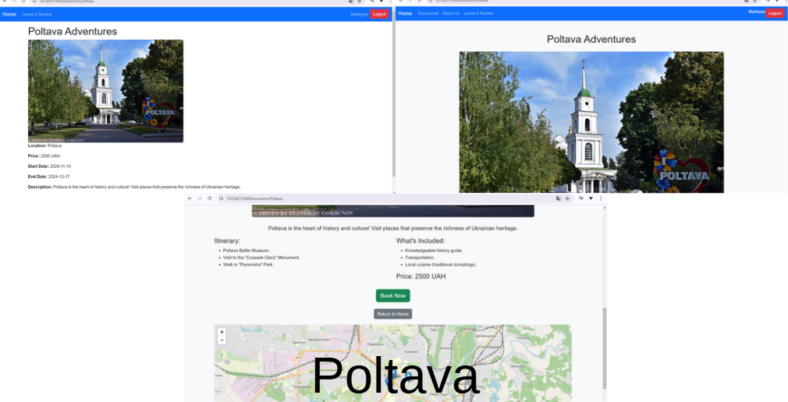

# Adventure Booking Platform – Full Project Description 🌍🏕️
## Project Overview
This project is a web-based travel booking platform designed to help users explore, book, and manage exciting excursions across various locations in Ukraine. The platform provides a user-friendly experience with authentication, a trip booking system, financial tracking, user reviews, and email notifications.

---

## Features & Functionalities
#### 🛂 User Authentication & Registration
* Secure user registration and login system with password hashing.
* Users must provide a name, email, and password to sign up.
* Passwords are stored safely using hashed encryption (Werkzeug security).
* Users stay logged in using session-based authentication.
#### 🎟 Excursion Booking System
* Users can browse a wide range of excursions across Ukraine.
* Each excursion includes:
    * Name & location
    * Start & end date
    * Description & pricing
    * An image preview
* To book an excursion, the user must be logged in.
* Once booked, the trip cost is deducted from the user’s account balance.
* If a user does not have enough funds, they cannot proceed with the booking.
* Each excursion has a maximum capacity, preventing overbooking.
* Users cannot book the same excursion twice.
#### 💰 Financial System & Transaction Logging
* Each registered user starts with 10,000 bonus points.
* The cost of an excursion is subtracted from the user's balance after booking.
* If a user's balance is too low, they cannot book a trip.
* A transaction log keeps track of all user payments and bookings.
#### ⭐ User Feedback & Reviews
* Users can leave reviews about an excursion they attended.
    * Each review includes:
    * Rating (mark)
    * Message
    * Timestamp
* Feedback is stored in the database and can be accessed later.
* Users can view their review history through their profile.
#### 🔐 Security & Error Handling
* Password hashing ensures secure authentication.
* Users cannot modify or delete other users' bookings.
* If an excursion does not exist, a 404 error page is shown.
* Built-in exception handling ensures the system does not crash.
#### 🎭 Role Management & Booking Restrictions
* The system ensures that only logged-in users can book excursions.
* Users cannot delete or modify bookings manually.
* Each booking is linked to a specific user ID, ensuring personal tracking.

---

## Demo screens

---

## Admin Commands & Functions
The system provides several admin functionalities to help manage the platform:

Command	| Description
:-------|------------:
add_excursion(name, location, price, start_date, end_date, image, description)	| Adds a new excursion to the database.
remove_excursion(name) |	Deletes an excursion.
list_excursions() |	Displays all available excursions.
clear_feedbacks() |	Deletes all user feedbacks.
reset_balances() | Resets all user balances.

Only authorized administrators can perform these actions.

---

## Technical Implementation
#### 🗄 Database Management (SQLite)
* Uses Flask-SQLAlchemy for efficient data storage.
* Stores user data, excursions, bookings, and feedback.
* Ensures data persistence across system restarts.
#### ⚡ Flask-Powered Backend
* Built using Flask for lightweight and scalable web development.
* Implements routes for authentication, booking, and reviews.
* Uses Jinja2 templating for rendering dynamic content.
#### ⏳ Async Programming & Task Scheduling
* Uses asyncio for handling delayed actions (e.g., email notifications).
* Background tasks handle booking confirmations without blocking other operations.
#### 🚨 Error Handling & Logging
* try-except blocks prevent unexpected crashes.
* Logs all errors, failed bookings, and warnings for debugging.

---

## How It Works – Step by Step

#### 🏁 Startup Process
1. The system initializes the database and loads excursions.
2. It checks if users exist and creates default values if needed.
3. Fetches all excursions and user bookings from the database.
4. Displays a welcome message on the homepage.
#### 📩 Message & Booking Handling
1. Users browse excursions from the main page.
2. Upon clicking "Book Now":
    * The system checks their balance.
    * If the user has enough funds, the booking is confirmed.
    * If not, they receive a "Not Enough Funds" message.
#### 🔍 Viewing Excursions & User Bookings
1. Users can filter excursions based on price, location, and availability.
2. Logged-in users can view their personal booking history.
3. Admins can access all bookings and feedbacks.

---

## Why This Platform is Useful?
✅ Easy-to-use interface for booking trips.
✅ Automates financial tracking and prevents unauthorized bookings.
✅ Encourages user feedback to improve excursion quality.
✅ Secure authentication system to prevent unauthorized access.
✅ Reduces admin workload by automating booking and reviews.

---

## Future Improvements 🚀
🔹 Admin Dashboard for managing excursions.
🔹 Payment Integration for real-money transactions.
🔹 Google Maps API for location-based searches.
🔹 Multi-language Support for international users.

---

## Final Thoughts
This Adventure Booking Platform is a powerful and efficient tool for organizing and managing excursions in Ukraine. It allows users to explore, book, and review trips while maintaining secure transactions and automated notifications.

Would you like any additional features or modifications? 🚀😊

---

# Adventure site